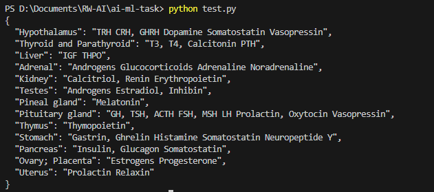

## Explanation

### 1. Image Annotation

Using [VGG Image Annotator (VIA)](https://www.robots.ox.ac.uk/~vgg/software/via/via_demo.html), we annotated the input sample image into two categories: Headings (glands/organs) and Subheadings (hormones).


The JSON data of these bounding boxes was exported for further processing.

### 2. Image Blurring

Using OpenCV, we applied GaussianBlur to create two versions of the image:
1. An image with everything blurred except the headings
2. An image with everything blurred except the subheadings


### 3. Optical Character Recognition (OCR)

Implemented EasyOCR, which is built on PyTorch, to read the text from these two blurred images. This process created two sets of texts: headings and subheadings.

### 4. Mapping Creation

Using the two JSON files extracted from the VGG annotator, we mapped the headings and subheadings in sorted order based on their coordinates. We then created a dictionary using the tokens produced by the EasyOCR model.

### 5. JSON Output

Finally, we converted the dictionary into a JSON format and output the result.


```{
  "Hypothalamus": "TRH CRH, GHRH Dopamine Somatostatin Vasopressin",
  "Thyroid and Parathyroid": "T3, T4, Calcitonin PTH",
  "Liver": "IGF THPO",
  "Adrenal": "Androgens Glucocorticoids Adrenaline Noradrenaline",
  "Kidney": "Calcitriol, Renin Erythropoietin",
  "Testes": "Androgens Estradiol, Inhibin",
  "Pineal gland": "Melatonin",
  "Pituitary gland": "GH, TSH, ACTH FSH, MSH LH Prolactin, Oxytocin Vasopressin",
  "Thymus": "Thymopoietin",
  "Stomach": "Gastrin, Ghrelin Histamine Somatostatin Neuropeptide Y",
  "Pancreas": "Insulin, Glucagon Somatostatin",
  "Ovary; Placenta": "Estrogens Progesterone",
  "Uterus": "Prolactin Relaxin"
}```


## Steps to Run the Code

1. Clone the repository:
   ```
   git clone https://github.com/harshithb3304/ai-ml-task
   ```

2. Install the required dependencies:
   ```
   pip install -r requirements.txt
   ```

3. Run the script:

   - For Windows:
     ```
     python test.py
     ```

   - For macOS/Linux:
     ```
     python3 test.py
     ```

## Requirements

The following libraries are required to run this project:

- opencv-python
- numpy
- easyocr
- torch
- torchvision

You can install these dependencies using the provided `requirements.txt` file.


